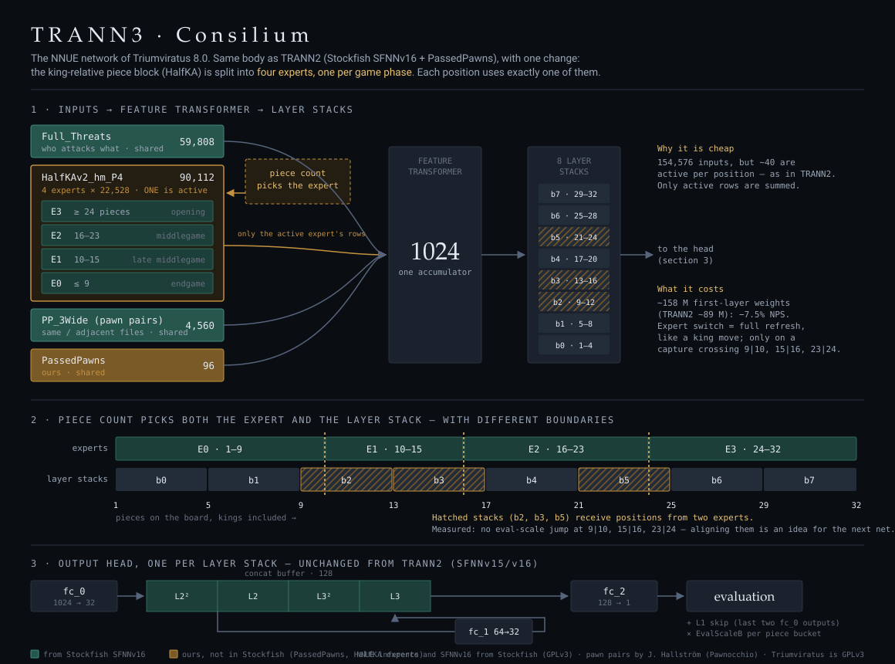

# Triumviratus — Networks

Triumviratus ships its **own** NNUE network — weights trained by the project, **not** a Stockfish network.

To be precise about provenance (and GPL-honest):
- The NNUE **evaluation code** and the base network **architecture** are Stockfish's (GPLv3 — see
  [`README`](README.md) and [`COPYING`](COPYING)).
- The official Stockfish **trainer** ([`nnue-pytorch`](https://github.com/official-stockfish/nnue-pytorch)) is used
  to train, with our own feature blocks added.
- The **training data is public** — Leela Chess Zero and Stockfish self-play binpacks, re-labelled by the community.
- What is **ours** is the **network weights**: trained from scratch, with no Stockfish network used as a seed or
  teacher, on a data mix and schedule we chose.

The pawn-pair block was invented by Jonathan Hallström for Pawnocchio and is now Stockfish's `PP_3Wide`; our
implementation and weights are ours, the idea is his. **`PassedPawns` is original to this project.**

---

**Every network file, with its complete recipe** (binpacks, trainer patches, commands, scripts), is in the companion
repository **[Triumviratus-Networks](https://github.com/Tors3/Triumviratus-Networks)**.

## Earlier networks, in brief

The full record of each one — data, recipe, epoch-by-epoch measurements — is in
[`archive/NETWORKS_4.2-7.0.md`](archive/NETWORKS_4.2-7.0.md).

| Network | Release | Architecture | How it was made | Result |
|---|---|---|---|---|
| `rubicon-v1` | 4.2 | `HalfKAv2_hm^`, L1 2560 | from scratch on Leela T80 | first own net, ≈ −39 Elo vs the Stockfish net of the time |
| `rubicon-alea-v1` | 5.0 | SFNNv13 (threats), L1 1024 | two stages: Stockfish data, then Leela data | ≈ +50 Elo for 5.0 over 4.2 |
| `rubicon-alea-v2` | 6.0 | + `PawnPair` block | fine-tune of v1, `PawnPair` grafted at zero | +18 Elo over v1 (net isolated) |
| `rubicon-alea-v3` | 6.0 | + `PassedPawns` block | frozen base, only the new block trained (~4 epochs) | +7 Elo over v2 (net isolated) |
| `legio-septima` | 7.0 | SFNNv16, L1 1024 | full training from scratch, 479 + 800 epochs | +23 Elo over v3 (net isolated) |

---

## MoE-1024 — the Triumviratus 8.0 network (in training)

> **Status: in training since 28 September 2026, 13:39 UTC.** Not released, name still open. This section records the
> design, the choices and every measurement as they happen, so the result can be read against them.

### Why a new network

`legio-septima` ended its run **saturated**:
- no gain between stage-1 epochs 249 and 416;
- a stage-3 annealing tail that measured zero (−0.28 ± 5.21 Elo over 5,024 games);
- validation loss never above training loss.

The conclusion was that the lineage needed more **capacity**, not more epochs. The obvious way to add it — a wider
L1 — is expensive at game time. Measured on our engine with random nets of each shape:

| option | NPS vs L1 = 1024 |
|---|---|
| L1 = 2048 | −20.0 % |
| L1 = 1536 | −11.2 % |
| **L1 = 1024, HalfKA as 4 experts (this net)** | **−7.5 %** |

L1 must be a multiple of 256 for the sparse affine path, so between 1024 and 1536 the only width available is
1280. It was considered and not measured: the choice was the cheapest option in NPS, with a MoE-1280 kept as the next
step if the MoE-1024 gains little.

### The idea: a mixture of experts on the king-relative block

The `HalfKAv2_hm` block gets **four weight sets**, one per material phase, chosen by the number of pieces on the
board. Only one set is active per position, so evaluation costs almost the same as a single block. The network gets
four times the parameters where a single set has to compromise most: how the value of a piece on a square changes
between the opening and the endgame.

What it is **not**: a network four times wider. The accumulator is still 1024 values and the layers after it are
unchanged (they already have 8 buckets by piece count). The experts specialise how those 1024 values are computed;
they do not enlarge them.

| | 7.0 — `legio-septima` | 8.0 — MoE-1024 |
|---|---|---|
| Base architecture | SFNNv16 | SFNNv16 |
| L1 / L2 / L3 | 1024 / 32 / 32 | 1024 / 32 / 32 |
| `Full_Threats` | 59,808 | 59,808 |
| King-relative block | `HalfKAv2_hm`, 22,528 | **`HalfKAv2_hm_P4`, 4 × 22,528 = 90,112** |
| `PP_3Wide` (pawn pair) | 4,560 | 4,560 |
| `PassedPawns` | 96 | 96 |
| **Total inputs** | **86,992** | **154,576** |

- **Phases** by piece count, kings and pawns included: **≤ 9, 10–15, 16–23, ≥ 24**. The cut points are
  equal-frequency bins measured on the corpus, so each expert sees roughly a quarter of the positions.
- **Trainer** (`HalfKAv2_hm_P4^`, our addition to `nnue-pytorch`): each expert's weight is a shared base plus a
  per-phase delta, plus the usual virtual (factorised) features — 162,768 training inputs.
  - The deltas start at zero, so training starts from an ordinary HalfKA network. The base learns from every
    position; the experts separate only where the data asks them to.
  - Export folds the three terms into the four plain weight sets the engine reads.
- **Engine** (build option `TRIUMV_PSQ_PHASES=4`):
  - a capture that crosses a phase boundary forces an accumulator refresh;
  - the Finny-table cache is kept per phase;
  - the network hash changes, so a MoE net cannot be loaded by a plain build or the other way round;
  - the default build is unchanged: 1 phase, bench identical.

### Verified before training

- **Engine against trainer** on the same random network, with the per-phase deltas set to random values. With zero
  deltas a wrong phase index would be invisible, so the random net is built with `--perturb-phases`. Over 4,096
  positions of `test80-2023-11-nov`:

  | | R² | mean error | 3σ |
  |---|---|---|---|
  | float | 0.999999 | 1.70 | 5.09 |
  | quantized | 1.000000 | 0.64 | 1.84 |

- **Incremental against full-refresh** evaluation in the engine: **0 mismatches** on 51 positions.
- **Smoke test** of the whole pipeline on the training machine: 2 short pretraining epochs, conversion, fine-tune
  resumed from the model, export to `.nnue`. Checkpoints are 3.9 GB, exported nets 161 MB (leb128).

### Data: one mix, every label BT4

A single mix from the start, as Stockfish's current recipe does, instead of the two stages of `legio-septima`.
Everything is **re-labelled with Leela's BT4**, so the whole run shares one label scale.

| source | files | size |
|---|---|---|
| [`vondele/master-binpacks_relabel`](https://huggingface.co/datasets/vondele/master-binpacks_relabel) (Stockfish self-play + DFRC) | 5 | 129.4 GB |
| `vondele/linrock_relabel_1` (Leela `test80`, `test78`, `test77`, `test60`) | 13 | 203.9 GB |
| `vondele/linrock_relabel_2` (Leela `test80`, 2023) | 12 | 141.8 GB |
| `vondele/from_kaggle_2_relabel` (T60/T70 wrongIsRight) | 5 | 110.6 GB |
| `vondele/from_kaggle_1_relabel` (`leela96`) | 5 | 97.6 GB |
| `xushawn/test80-bt4-relabel` (Leela `test80`, early 2024) | 2 | 17.7 GB |
| **downloaded** | **42** | **701 GB** |

**40 files are used.** The two `test60-2021` files of 3 GB are excluded: the loader picks files uniformly, not by
size, so a small file would be read many times over. Anything under 5 GB is left out. Also excluded: T91 (not
re-labelled) and our own self-play.

The planned 790 GB turned out to be 701 GB, checked file by file against the Hugging Face API: one `test80`
month exists both whole and split in two parts and is downloaded once, and `xushawn/test80-bt4-relabel` is 17.7 GB,
not ~33. No data is missing.

### Recipe

Stockfish's SFNNv16 recipe (`vondele/nettest`, `threats.yaml`), scaled to the batch and the budget.

| | pretraining (P) | fine-tune (F) |
|---|---|---|
| Length | **450 epochs × 1 G positions** | **22 epochs**, resumed from P |
| Batch | **524,288** | 262,144 |
| lr | **8e-4** (SFNNv16's 4e-4 at batch 131,072, × √4) | 5.66e-4 |
| Schedule | one-cycle, 5 % warmup, final divisor 1000 | one-cycle |

- **Lambda, as launched:** **1.0 with a cycle** that dips by 0.3 (25 % warmup), plus jitter (0.0035 per sample,
  0.0070 per batch, decay 0.999), as in SFNNv16. That cycle dips to 0.7 at epoch ≈ 112 and **climbs back to 1.0**
  by the end of P, and restarts in F.
- **Lambda, changed at epoch 292** (see [the plateau](#the-plateau-and-the-lambda-fix)): a linear descent from 0.865
  to **0.75** over 40 epochs (reached at epoch 332), then **0.75 fixed** to the end of P and through all of F — the
  target every earlier own network finished on.
- **Piece-count sampling:** `pc-y` −0.20 / 0.45 / 1.0 / 0.95 / 0.75.
- **Skipping:** `random-fen-skipping 2`. Openings are **soft**-skipped (`soft-early 20`) and never hard-skipped: the
  ≥ 24-piece expert needs opening positions, but book lines repeated across millions of games are down-weighted.
- **Total:** **≈ 472 G positions** seen, about 3.7× `legio-septima` (≈ 128 G over both stages) and about 80 % of
  SFNNv16's run (≈ 600 G). The corpus holds roughly 270 G usable positions, so each is seen about 1.7 times on
  average.
- **Exports:** a `.nnue` every 45 epochs (10 % of P), plus on-demand exports of the live checkpoint, serialised on the
  training machine's CPU without touching the GPUs.

### Hardware, throughput and cost

**4× RTX 5090** (32 GB, PCIe 5.0, one NUMA node), 192 CPU threads, 251 GB RAM, rented on vast.ai at about **3 $/h**.

| step | positions/s |
|---|---|
| first DDP reading, loader tuned as for `legio-septima` | 1.4 M |
| loader feature-thread share 0.05 → **0.1**, 46 workers per GPU | 4.79 M (skip 3) |
| **final configuration**, skip 2, batch 524,288 | **4.97 M** |

- **The limit was the data loader, not the GPUs.** The feature-thread share that was optimal for `legio-septima`
  (0.05) leaves a single thread per GPU to build the input features, and threats plus experts cost more to build:
  about 350 k positions/s per thread. One 5090 alone went from 381 k positions/s (GPU at 28 %) to 1.9 M (GPU at
  95 %) with a larger share.
- **A profile misled first.** A synthetic benchmark (120 random active features) put 71 % of the step in the
  feature-transformer backward and suggested rewriting it. On real batches — 52 active features per side,
  concentrated — the upstream kernel takes 14.7 ms per 65,536 positions and the rewrite (verified correct, relative
  error 1.4e-6) takes 18.0 ms. It is not used.
- **DDP costs almost nothing here:** four GPUs give 4× one GPU, so the all-reduce over PCIe 5.0 is negligible.
- **Batch:** 131,072 → 262,144 → 524,288 gains about 7 % per doubling. At 262,144 with the full recipe the run
  measured 3.28 M positions/s — too slow for the budget, so the run was restarted at 524,288.
- **Cost:** about **0.17 $ per billion positions**, the same as the `legio-septima` machine (4× RTX 5060 Ti) but about
  six times faster; ≈ 80 $ for the whole run. An 8× RTX 3090 offer at 1.93 $/h was rejected: its 80-thread CPU cannot
  feed the loader.

Steady state: 201–212 s per epoch, GPUs at 97–99 %, 63–68 °C, well below their power limit. The last 3 % of speed
comes and goes with the GPU boost clock.

### Training so far

Checkpoints are numbered from 0, as the trainer does: "epoch 44" is the end of the 45th epoch.

| epoch | training loss |
|---|---|
| 1 | 0.0122 |
| 7 | 0.0081 |
| 20 | 0.0047 |
| 27 | 0.0041 |
| 42–69 | 0.0038–0.0041 |
| 80–124 | 0.0042–0.0045 (the lambda cycle is raising the floor, see below) |

The loss is not comparable across the whole run: lambda moves with its cycle, and the achievable floor moves
with it (see the `legio-septima` note in the archive).

### Strength during training

Each checkpoint plays `legio-septima` with **the same 8.0 search** on both sides: two builds from the same source and
compiler (MinGW, AVX-512, no PGO), the MoE one with `TRIUMV_PSQ_PHASES=4`. The only difference is the network. One
thread, 64 MB hash, UHO 2024 (+0.85/+0.94) openings, 75 games at a time.

| epoch | TC | games | W / D / L | Elo vs `legio-septima` |
|---|---|---|---|---|
| ≈ 16 | 20+0.2 | 131 | 5 / 44 / 82 | ≈ −230 |
| 20 | 20+0.2 | 143 | 11 / 58 / 74 | ≈ −164 |
| 26 | 20+0.2 | 355 | 26 / 164 / 165 | −144 |
| 30 | 20+0.2 | 589 | 59 / 274 / 256 | −121 ± 21 |
| 35 | 20+0.2 | 2,000 | 190 / 991 / 819 | −113 ± 11 |
| 44 | 20+0.2 | 2,000 | 264 / 989 / 747 | −86 ± 11 |
| 53 | **30+0.3** | 1,774 | 214 / 963 / 597 | −76 ± 11 |
| 64 | 30+0.3 | 1,001 | 139 / 562 / 300 | −56 ± 14 |
| 71 | 30+0.3 | 1,012 | 121 / 569 / 322 | −70 ± 14 |
| 80 | 30+0.3 | 2,000 | 315 / 1,052 / 633 | −56 ± 11 |
| 99 | 30+0.3 | 1,159 | 191 / 631 / 337 | −44 ± 14 |
| 110 | 30+0.3 | 2,000 | 311 / 1,048 / 641 | −58 ± 11 |
| 124 | 30+0.3 | 2,000 | 357 / 1,059 / 584 | −40 ± 10 |
| 134 | 30+0.3 | 1,370 | 233 / 742 / 395 | −41 ± 12 |
| 145 | 30+0.3 | 995 | 187 / 519 / 289 | −36 ± 15 |
| 157 | 30+0.3, **scale** | 1,220 | 210 / 690 / 320 | −31 ± 13 |
| 165 | 30+0.3, scale | 898 | 177 / 483 / 238 | −24 ± 16 |
| 171 | 30+0.3, scale | 2,000 | 356 / 1,125 / 519 | −28 ± 10 |
| 200 | 30+0.3, scale | 2,000 | 405 / 1,085 / 510 | −18 ± 10 |
| 254 | 30+0.3, scale | 1,187 | 257 / 654 / 276 | −6 ± 13 |
| 262 | 30+0.3, scale | 1,154 | 254 / 661 / 239 | **+5 ± 13** |
| 272 | 30+0.3, scale | 604 | 130 / 323 / 151 | −12 ± 19 |
| 278 | 30+0.3, scale | 701 | 151 / 385 / 165 | −7 ± 17 |
| 293 | 30+0.3, scale, **new lambda** | 909 | 211 / 480 / 218 | −3 ± 16 |
| 299 | 30+0.3, scale, new lambda | 886 | 201 / 460 / 225 | −9 ± 16 |
| 311 | 30+0.3, scale, new lambda | 1,491 | 340 / 794 / 357 | −4 ± 12 |

- **The gap closed fast up to epoch ≈ 60, then the curve went flat** at −45 to −70. The flat stretch coincides with
  the learning rate near its peak. The schedule is a cosine one-cycle: warmup to 8e-4 by epoch ≈ 22, still above
  90 % of the peak until epoch ≈ 110, 84 % at 135, 54 % at 225, 23 % at 315. The previous own networks gained most of
  their strength late, while the rate decayed.
- **From epoch 53 the time control is 30+0.3.** The MoE build is 7.5 % slower, and a longer time control weighs that
  less, so the comparison reads the evaluation more than the speed. The two series are not strictly comparable.
- A self-check early on: epoch ≈ 16 against epoch ≈ 5, 74 / 31 / 4 in 109 games (≈ +265 Elo).
- **A prediction that failed.** A logarithmic fit of the early 20+0.2 points (Elo ≈ 111·ln(epoch) − 508) put parity
  near epoch 96. Registered before the match, it predicted −32 for epoch 71; the match gave −70 ± 14. Early points
  on a steep curve say little about the plateau that follows.
- **Checkpoints fixed in advance:** at epoch 225 (rate at 54 %) the network should be at −30 or better, otherwise
  the run needs a closer look; at epoch 315 it should be near parity. **Both were met** (−18 at 200, parity from 254).
- **From epoch 124 to 254 the curve rose on a straight line**, about +3.8 Elo every 10 epochs. A weighted linear fit
  of the uncalibrated points 53–145 predicted −17 at epoch 200 and parity near 240; the later points, not used in the
  fit, landed on it. **Then it went flat at parity**, from epoch ≈ 250 to at least 311.
- Two direct MoE-against-MoE checks (10+0.1, 2,000 games, same scale on both sides) confirm the plateau is in the
  network and not in the match: epoch 285 vs 278 **−2.1 ± 10.1**, epoch 305 vs 291 **+3.5 ± 10.7**.

#### Eval scale per phase ("scale" in the table)

The engine compresses the raw network output with a per-bucket factor, `EvalScaleB0..B7` (default 60, the value tuned
for `legio-septima`), before search thresholds use it. The MoE has its own scale, so it was measured: the raw static
eval of both nets on 40,000 positions from these matches, compared bucket by bucket (orthogonal regression).

- At epoch 145 the MoE matched `legio-septima` everywhere **except 5–8 pieces**, where it read about **13 % higher**.
  The scale depends on the piece count only: no jump at the expert boundaries 9|10, 15|16, 23|24.
- Corrected set for the MoE side: **64 / 53 / 62 / 60 / 60 / 59 / 59 / 60**. Against the default on the same
  network at 10+0.1: +6.1 ± 10.1 over 2,225 games — small, stopped before a verdict, adopted for all later tests.
- At epoch 254 the network had drifted: the opening buckets now read 6–9 % *lower* than `legio-septima`. A set that
  matched the ratios again (60 / 54 / 60 / 61 / 60 / 62 / 64 / 66) was tried on epoch 262 and did **worse**:
  −27 ± 24 over 327 games against +5 ± 13 over 1,154 with the old set. It was dropped. Matching the raw ratio is not
  what the search wants in the opening; the final values will be tuned by SPSA on the finished network.

#### The plateau and the lambda fix

The training and validation losses could not explain the plateau: both kept falling. But they are computed at the
current lambda, and **lambda was moving**: the SFNNv16 cycle dips to 0.7 at epoch ≈ 112 and then climbs back towards
1.0 — pure evaluation, no game result — by the end of the run. Every earlier own network (`rubicon-alea`,
`legio-septima`) finished on **lambda 0.75 fixed**; `legio-septima` spent 700 of its 800 stage-2 epochs there.

To separate learning from the moving target, five checkpoints were scored on the **same 600,000 positions** of a
binpack the MoE never saw, with lambda held fixed (loss × 10⁻³):

| epoch | λ = 1.0 (predict the eval label) | λ = 0.0 (predict the game result) |
|---|---|---|
| 110 | 4.78 | 18.65 |
| 145 | 4.68 | 18.46 |
| 200 | 4.53 | **18.36** |
| 254 | 4.34 | 18.47 |
| 285 | 4.23 | 18.40 |

- Against the eval labels the network **kept improving at a constant rate**: no saturation, no over-fitting.
- Against game results it **stopped improving at epoch ≈ 200**. Games are won on results, and the Elo plateau starts
  right after.
- The cycle was pushing the network towards imitating the labels, and it did exactly that.

So at epoch 292 the run was stopped at an epoch boundary and resumed from the checkpoint (weights, optimiser,
learning-rate schedule and step count restored) with the lambda change described under [Recipe](#recipe). Two
details of the resume, both handled:

- the trainer re-runs the epoch stored in the checkpoint; left alone, that extra epoch would have pushed the step count
  past the one-cycle schedule and crashed the last epoch of P, so the stored epoch was advanced by one;
- the fine-tune F would have restarted the lambda cycle from 1.0; it now runs at 0.75 throughout.

The loss rises while lambda descends (a noisier target), as it did between epochs 39 and 119 while the network gained
70 Elo. The first test of the fix is at epoch ≈ 335, with lambda settled.

### How it will be judged

The final network (end of F), net-isolated against `legio-septima` at 20+0.2, then at a longer time control, with
the same search on both sides. It ships in 8.0 only if it wins clearly.

---

## What "own-lineage" means (and does not)

- **Means:** the network *weights* shipped with Triumviratus are trained by the project, **from scratch**, with
  **no Stockfish network used as a seed or teacher**. Every training run starts either from random initialisation or
  from one of our own earlier networks.
- **Does not mean: our own data.** The training data is overwhelmingly **public** — Leela Chess Zero and Stockfish
  self-play binpacks. The project's own self-play contributed a small minority to one network (`rubicon-alea-v2`,
  ≈ 6.5 %) and none to the 8.0 run. What is ours is the training, the mix, and the resulting weights.
- **Does not mean:** independence from Stockfish *code*. The NNUE inference and the base architecture are Stockfish's
  (GPLv3), extended with our own input blocks, and the trainer is Stockfish's `nnue-pytorch`. The whole project is
  GPLv3 and credits Stockfish accordingly (see `README` / `COPYING`).
- **Why it still matters:** what the project gets is a network whose weights, mix and feature extensions are its own
  rather than a redistribution of someone else's.
